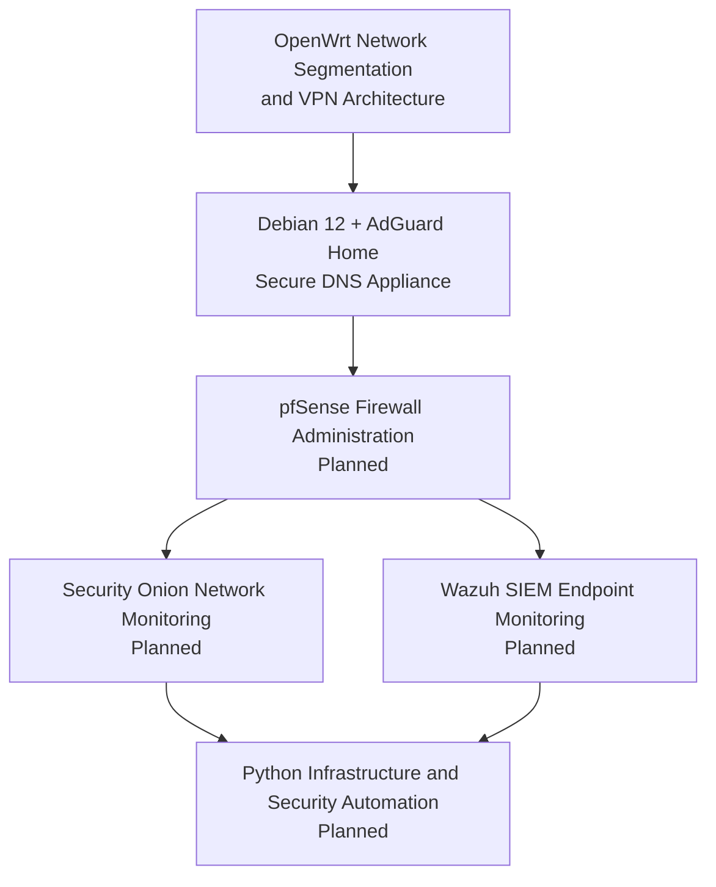

# IT & Cybersecurity Portfolio Projects

This directory contains public-facing technical projects from ongoing infrastructure, networking, systems administration, and cybersecurity lab work.
    
The projects are written as professional technical documentation rather than blog posts or certification notes. Each project is intended to demonstrate practical implementation, validation, troubleshooting, and security-focused decision-making in a self-hosted environment.
    
Most work published here originates from larger private lab environments and long-term learning projects. Public releases are reviewed and sanitized before publication to remove credentials, real network details, device-specific identifiers, sensitive configuration values, and operationally unsafe information where applicable.
    
---

## Table of Contents

- [Current Projects](#current-projects)
- [Project Roadmap](#project-roadmap)
- [Current Architecture Progression](#current-architecture-progression)
- [Project Documentation Standards](#project-documentation-standards)
- [Sanitization Notes](#sanitization-notes)
- [Planned Additions](#planned-additions)
    
  ---
    
## Current Projects

| Sequence | Project | Focus Areas | Status |
| --- | --- | --- | --- |
| 01 | [OpenWrt Network Segmentation and VPN Architecture](openwrt-network-segmentation-vpn/) | VLANs, DHCP, wireless segmentation, firewall zones, guest/IoT isolation, WireGuard VPN routing | Published |
| 02 | [Debian 12 + AdGuard Home Secure DNS Appliance](debian12-adguard-home-secure-dns-appliance/) | Linux administration, DNS services, AdGuard Home, DNS filtering, UFW hardening, DNS-over-HTTPS | Published |
| 03 | pfSense Firewall Administration | Firewall rules, NAT, inter-VLAN routing, access control, VPN services | Planned |
| 04 | Security Onion Network Monitoring | IDS, packet analysis, traffic inspection, network security monitoring | Planned |
| 05 | Wazuh SIEM Endpoint Monitoring | Endpoint monitoring, centralized logging, alerting, event analysis | Planned |
| 06 | Python Infrastructure and Security Automation | Scripting, validation automation, IOC enrichment, operational workflows | Planned |

---

## Project Roadmap

Current Architecture Progression
--------------------------------

The current published projects represent the first two layers of a larger infrastructure and cybersecurity portfolio.

### 01 - OpenWrt Network Segmentation and VPN Architecture

The OpenWrt project establishes the network foundation.

It documents a segmented network architecture using VLAN-backed interfaces, DHCP scopes, wireless network separation, firewall zones, guest/IoT isolation, and WireGuard VPN routing.

This project demonstrates:

- Network segmentation
- VLAN planning
- DHCP scope design
- Wireless network separation
- Guest and IoT containment
- Firewall zone policy
- VPN egress routing
- Validation and troubleshooting procedures

### 02 - Debian 12 + AdGuard Home Secure DNS Appliance

The Debian + AdGuard Home project builds on the network foundation by adding centralized DNS visibility and filtering.

It documents the deployment of a Debian-based DNS appliance using AdGuard Home, Quad9 DNS-over-HTTPS, static network configuration, UFW firewall hardening, and operational validation.

This project demonstrates:

- Linux server administration
- DNS service deployment
- Static IP configuration
- UFW firewall hardening
- AdGuard Home configuration
- Encrypted upstream DNS
- DNS visibility and filtering
- Service validation and troubleshooting  

Project Documentation Standards
-------------------------------

Each project is intended to answer four main questions:

1. What was built? 
2. Why was it built?
3. How was it built?
4. How was it validated?

Project documentation generally includes:
- A high-level README.md  
- Implementation notes
- Validation procedures
- Security considerations
- Troubleshooting notes
- Sanitized configuration examples where appropriate    
- Mermaid architecture diagrams

The goal is for each project to show practical technical work, not just theoretical knowledge.

Sanitization Notes
------------------

Some documentation intentionally omits or generalizes:
- Credentials
- Private keys
- Real SSIDs
- Real internal IP ranges
- Public IP addresses
- MAC addresses
- Hostnames
- Exact hardware models
- VPN provider details
- Management addresses
- Screenshots containing sensitive details
- Environment-specific identifiers
- Unsafe or unnecessarily exposed configurations

Example values may be used in place of real values to preserve the technical design while keeping the public documentation safe.

Planned Additions
-----------------

Future projects are expected to expand the environment into more advanced infrastructure and security operations, including:
- pfSense firewall administration 
- Managed switch VLAN trunking and access port design
- Dedicated management VLANs
- DNS enforcement and bypass reduction
- Security Onion network security monitoring
- Wazuh SIEM deployment
- Python-based validation and security automation

The long-term goal is to build a connected portfolio that demonstrates infrastructure support, network administration, systems administration, security monitoring, and security engineering progression.