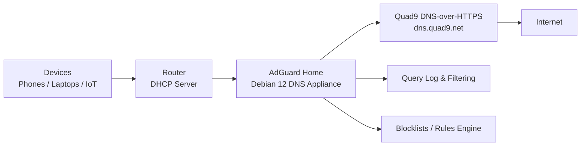

```mermaid
graph LR
    A[Devices<br/>Phones / Laptops / IoT] --> B[Router<br/>DHCP Server]
    B --> C[AdGuard Home<br/>Debian 12 DNS Appliance]

    C --> D[Quad9 DNS-over-HTTPS<br/>dns.quad9.net]
    D --> E[Internet]

    C --> F[Query Log & Filtering]
    C --> G[Blocklists / Rules Engine]
```
