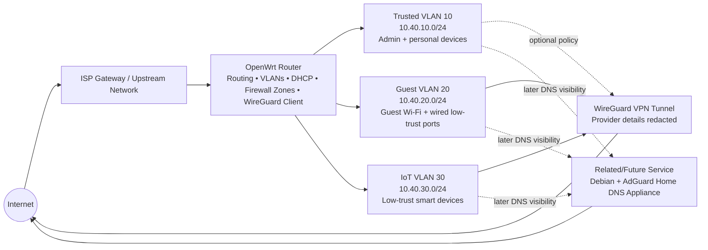
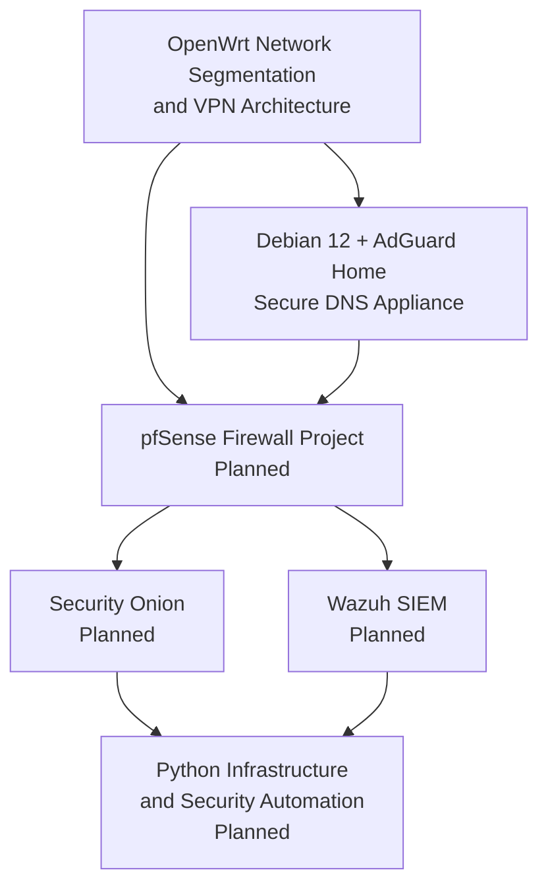

# OpenWrt Network Segmentation and VPN Architecture
> **Platform:** OpenWrt
> **Focus Areas:** VLANs, DHCP, wireless segmentation, firewall zones, WireGuard VPN routing, validation, and secure documentation
> **Environment:** Self-hosted home lab
> **Status:** Public sanitized release

---

## 📑 Table of Contents

- [Overview](#overview)
- [Objectives](#-objectives)
- [Architecture](#-architecture)
- [Sanitized Network Design](#-sanitized-network-design)
- [Repository Structure](#-repository-structure)
- [Key Technical Outcomes](#-key-technical-outcomes)
- [Validation Highlights](#-validation-highlights)
- [Security Controls Demonstrated](#-security-controls-demonstrated)
- [Related Portfolio Projects](#-related-portfolio-projects)
- [Lessons Learned](#-lessons-learned)
- [Future Improvements](#-future-improvements)

---

## Overview

This project documents the design and implementation of a segmented OpenWrt-based network environment using VLANs, wireless network separation, DHCP scopes, firewall zones, and router-level WireGuard VPN routing.

The purpose of the project is to demonstrate practical network administration and security engineering skills in a small but realistic lab environment. The configuration was built to separate trusted devices, guest systems, and IoT/low-trust devices while maintaining usable internet access and a clean path toward future firewall, DNS, SIEM, and monitoring projects.

This repository is intentionally sanitized. It does **not** publish exact hardware models, real SSIDs, real subnets, VPN provider details, public IP addresses, private keys, hostnames, MAC addresses, or management addresses.

---

## 🎯 Objectives

The main objectives were to:

- Build a segmented OpenWrt routing environment using VLAN-backed interfaces.
- Separate trusted, guest, and IoT device groups into distinct network zones.
- Assign low-trust wired access ports to a guest VLAN.
- Map wireless SSIDs to the appropriate trusted, guest, and IoT networks.
- Use DHCP scopes that make network placement easy to identify during troubleshooting.
- Route low-trust networks through a router-level WireGuard VPN tunnel.
- Prevent guest and IoT devices from reaching trusted systems or router administration services.
- Preserve a clean foundation for later DNS visibility, firewall administration, and monitoring projects.

---

## 🏗️ Architecture



---

## 🧱 Sanitized Network Design

The values below are representative documentation values. They are not the actual production/lab values.

| Network Zone | VLAN ID | Example Subnet | Purpose | Default Egress |
| --- | ---: | --- | --- | --- |
| Trusted | 10 | `10.40.10.0/24` | Admin workstation, personal devices, management access | WAN or optional VPN policy |
| Guest | 20 | `10.40.20.0/24` | Guest Wi-Fi and low-trust wired access ports | WireGuard VPN |
| IoT | 30 | `10.40.30.0/24` | Smart devices and other low-trust endpoints | WireGuard VPN |
| WAN | N/A | DHCP from upstream network | Internet uplink | ISP/upstream gateway |
| VPN | N/A | Tunnel interface | Privacy egress for low-trust networks | Commercial VPN provider, redacted |

### Wireless Publication Plan

| SSID Purpose | Example SSID | Band | Example Channel Plan | Security |
| --- | --- | --- | --- | --- |
| Trusted | `lab-main` | 5 GHz | Channel 44 / 80 MHz | WPA2/WPA3 mixed |
| Guest | `lab-guest` | 5 GHz | Channel 44 / 80 MHz | WPA2/WPA3 mixed, client isolation enabled |
| IoT | `lab-iot` | 2.4 GHz | Channel 6 / 20 MHz | WPA2-PSK AES for compatibility |

### Physical Port Plan

| Port Role | VLAN Behavior | Purpose |
| --- | --- | --- |
| WAN port | Not bridged into LAN | Uplink to upstream gateway |
| LAN access ports | Untagged/PVID member of Guest VLAN 20 | Wired low-trust/guest devices |
| WireGuard tunnel | Routed, not bridged | VPN egress path |

---

## 📁 Repository Structure

```text
openwrt-network-segmentation-vpn/
├── README.md
├── implementation.md
├── validation.md
├── security-considerations.md
├── troubleshooting.md
├── configs/
│ └── sanitized-network-plan.md
└── diagrams/
├── architecture.mmd
└── future-state.mmd
```

| File | Purpose |
| --- | --- |
| `README.md` | High-level project overview, architecture, outcomes, and portfolio context |
| `implementation.md` | Step-by-step implementation details and design decisions |
| `validation.md` | Test plan and verification evidence checklist |
| `security-considerations.md` | Threat model, hardening decisions, limitations, and sanitization policy |
| `troubleshooting.md` | Common failure scenarios and support-style troubleshooting steps |
| `configs/sanitized-network-plan.md` | Public-safe VLAN, DHCP, firewall, wireless, and UCI-style reference snippets |
| `diagrams/architecture.mmd` | Current-state Mermaid architecture diagram |
| `diagrams/future-state.mmd` | Planned portfolio expansion diagram |

---

## ✅ Key Technical Outcomes

- Configured VLAN-backed OpenWrt interfaces for trusted, guest, and IoT networks.
- Used bridge VLAN filtering to assign low-trust wired LAN ports to a guest VLAN.
- Created separate DHCP scopes for each logical network.
- Associated wireless SSIDs with the correct VLAN-backed interfaces.
- Built firewall zones that prevent guest and IoT networks from accessing trusted devices.
- Preserved DNS and DHCP access where required while blocking administrative access from low-trust networks.
- Routed low-trust networks through a WireGuard VPN tunnel without bridging the VPN interface into the LAN bridge.
- Validated segmentation using DHCP checks, route checks, ping tests, DNS tests, VPN egress checks, and negative access testing.

---

## 🧪 Validation Highlights

Validation focused on proving that the configuration worked as designed, not just that settings were entered into the UI.

| Validation Area | Expected Result |
| --- | --- |
| Trusted DHCP | Trusted clients receive `10.40.10.x` addresses |
| Guest wired DHCP | Wired low-trust clients receive `10.40.20.x` addresses |
| IoT DHCP | IoT clients receive `10.40.30.x` addresses |
| Guest isolation | Guest clients cannot reach trusted devices or router admin services |
| IoT isolation | IoT devices cannot reach trusted or guest devices |
| VPN egress | Guest and IoT clients show VPN egress instead of direct WAN egress |
| VPN failure behavior | Low-trust networks do not silently fall back to WAN when VPN routing is unavailable |
| DNS readiness | Design can later point DHCP DNS to the Debian + AdGuard Home appliance |

See [`validation.md`](validation.md) for the full test plan.

---

## 🛡️ Security Controls Demonstrated

This project demonstrates security thinking through implementation choices:

- **Segmentation:** Trusted, guest, and IoT devices are separated into different VLAN-backed networks.
- **Least Privilege:** Low-trust networks are only allowed the minimum router services required for functionality.
- **No WAN Bridging:** The WAN interface remains separate from the LAN bridge.
- **No VPN Bridging:** The WireGuard interface is routed through firewall policy rather than bridged into LAN.
- **Reduced Lateral Movement:** Guest and IoT networks cannot initiate connections into the trusted network.
- **Administrative Surface Reduction:** Router management is limited to trusted devices.
- **Public Sanitization:** Sensitive implementation details are removed from the public repository.

---

## 🔗 Related Portfolio Projects

This repository is part of a larger infrastructure and cybersecurity portfolio.



The OpenWrt project establishes the network foundation. The Debian + AdGuard Home project adds DNS visibility and filtering. Future pfSense, Security Onion, Wazuh, and automation projects can build on this same segmented architecture.

---

## 📚 Lessons Learned

Key lessons from the build:

- VLANs only become useful security boundaries when paired with firewall policy.
- Guest isolation should be validated with negative tests, not assumed from UI settings.
- VPN tunnels should be routed and controlled through firewall policy, not bridged into LAN.
- Keeping a trusted recovery path is important when changing bridge VLAN settings.
- Public documentation should show technical capability without exposing operational details.
- A clean network foundation makes later DNS, firewall, and monitoring projects easier to explain.

---

## 🚧 Future Improvements

Planned improvements include:

- Add a managed switch for trunk ports and dedicated access ports.
- Move advanced firewall policy enforcement to pfSense.
- Add a dedicated management VLAN.
- Integrate the Debian + AdGuard Home appliance as the primary DNS visibility layer.
- Enforce DNS usage and reduce DNS bypass paths.
- Add Security Onion for network security monitoring.
- Add Wazuh for endpoint monitoring and log analysis.
- Automate configuration checks and evidence collection with Python or shell scripts.