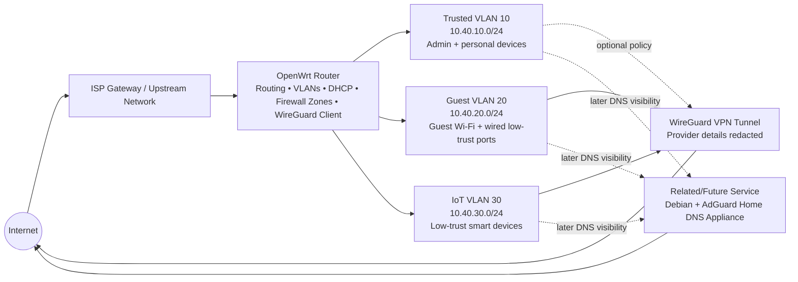

```mermaid
flowchart LR
    Internet((Internet))
    Upstream[ISP Gateway / Upstream Network]

    Router[OpenWrt Router<br/>Routing • VLANs • DHCP • Firewall Zones • WireGuard Client]

    Trusted[Trusted VLAN 10<br/>10.40.10.0/24<br/>Admin + personal devices]
    Guest[Guest VLAN 20<br/>10.40.20.0/24<br/>Guest Wi-Fi + wired low-trust ports]
    IoT[IoT VLAN 30<br/>10.40.30.0/24<br/>Low-trust smart devices]

    VPN[WireGuard VPN Tunnel<br/>Provider details redacted]
    DNS[Related/Future Service<br/>Debian + AdGuard Home DNS Appliance]

    Internet --> Upstream
    Upstream --> Router

    Router --> Trusted
    Router --> Guest
    Router --> IoT

    Guest --> VPN
    IoT --> VPN
    Trusted -. optional policy .-> VPN

    Trusted -. later DNS visibility .-> DNS
    Guest -. later DNS visibility .-> DNS
    IoT -. later DNS visibility .-> DNS

    DNS --> Internet
    VPN --> Internet
```