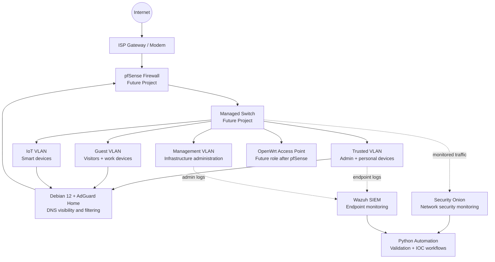

```mermaid
flowchart TD

    Internet((Internet))
    Modem[ISP Gateway / Modem]
    Firewall[pfSense Firewall<br/>Future Project]
    Switch[Managed Switch<br/>Future Project]

    Trusted[Trusted VLAN<br/>Admin + personal devices]
    Guest[Guest VLAN<br/>Visitors + work devices]
    IoT[IoT VLAN<br/>Smart devices]
    Mgmt[Management VLAN<br/>Infrastructure administration]

    OpenWrtAP[OpenWrt Access Point<br/>Future role after pfSense]
    AdGuard[Debian 12 + AdGuard Home<br/>DNS visibility and filtering]
    SecurityOnion[Security Onion<br/>Network security monitoring]
    Wazuh[Wazuh SIEM<br/>Endpoint monitoring]
    Automation[Python Automation<br/>Validation + IOC workflows]

    Internet --> Modem --> Firewall --> Switch

    Switch --> Trusted
    Switch --> Guest
    Switch --> IoT
    Switch --> Mgmt
    Switch --> OpenWrtAP

    Trusted --> AdGuard
    Guest --> AdGuard
    IoT --> AdGuard
    AdGuard --> Firewall

    Switch -. monitored traffic .-> SecurityOnion
    Trusted -. endpoint logs .-> Wazuh
    Mgmt -. admin logs .-> Wazuh

    SecurityOnion --> Automation
    Wazuh --> Automation
```